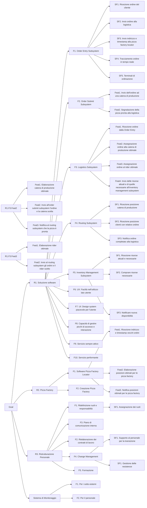

# RBS - Requirements Breakdown Structure

```mermaid

graph LR
    Goal --> R1[R1. Soluzione software]
        R1 --> R1.F1[F1. Order Entry Subsystem]
            R1.F1 --> R1.F1.SF1[SF1. Ricezione ordine del cliente]
            R1.F1 --> R1.F1.SF2[SF2. Invio ordine alla logistica]
            R1.F1 --> R1.F1.SF3[SF3. Invio indirizzo e timestamp alla pizza factory locator]
            R1.F1 --> R1.F1.SF4[SF4. Tracciamento ordine in tempo reale]
            R1.F1 --> R1.F1.SF5[SF5. Terminali di ordinazione]
            
        R1 --> R1.F2[F2. Order Submit Subsystem]
            R1.F2 --> R1.F2.SF1[Feat1. Invio dell'ordine ad una catena di produzione]
            R1.F2 --> R1.F2.SF2[Feat2. Segnalazione della pizza pronta alla logistica]
            
        R1 --> R1.F3[F3. Logistics Subsystem]
            R1.F3 --> R1.F3.SF1[Feat1. Ricezione ordine dalla Order Entry]
            R1.F3 --> R1.F3.SF2[Feat2. Assegnazione ordine alla catena di produzione ottimale]
                R1.F3.Feat2 --> R1.F3.SF2.Feat1[Feat1. Elaborazione catena di produzione ottimale]
                R1.F3.Feat2 --> R1.F3.SF2.Feat2[Feat2. Invio all'order submit subsystem l'ordine e la catena scelta]
                R1.F3.Feat2 --> R1.F3.SF2.Feat3[Feat3. Notifica al routing subsystem che la pizza è pronta]
            R1.F3 --> R1.F3.SF3[Feat3. Assegnazione ordine al rider ottimale]
                R1.F3.Feat3 --> R1.F3.SF3.Feat1[Feat1. Elaborazione rider ottimale]
                R1.F3.Feat3 --> R1.F3.SF3.Feat2[Feat2. Invio al routing subsystem gli ordini e il rider scelto]
            R1.F3 --> R1.F3.SF4[Feat4. Invio delle risorse attuali e di quelle necessarie all'inventory management subsystem]
    
        R1 --> R1.F4[F4. Routing Subsystem]
            R1.F4 --> R1.F4.SF1[SF1. Ricezione posizione catena di produzione]
            R1.F4 --> R1.F4.SF2[SF2. Ricezione posizione clienti con relativo ordine]
            R1.F4 --> R1.F4.SF3[SF3. Notifica ordine completato alla logistica]
            
        R1 --> R1.F5[F5. Inventory Management Subsystem]
            R1.F5 --> R1.F5.SF1[SF1. Ricezione risorse attuali e necessarie]
            R1.F5 --> R1.F5.SF2[SF2. Comprare risorse necessarie]
            R1.F5 --> R1.F5.SF3[SF3. Notificare nuova disponibilità]

        R1 --> R1.F6[F6. UX: Facilià nell'utilizzo lato utente]
        R1 --> R1.F7[F7. UI: Design system piacevole per l'utente]
        R1 --> R1.F8[F8. Capacità di gestire picchi di accesso e interazione]
        R1 --> R1.F9[F9. Servizio sempre attivo]
        R1 --> R1.F10[F10. Servizio performante]
        
    Goal --> R2[R2. Pizza Factory]
        R2 --> R2.F1[F1. Software Pizza Factory Locator]
            R2.F1 --> R2.F1.SF1[Feat1. Ricezione indirizzo e timestamp vecchi ordini]
            R2.F1 --> R2.F1.SF2[Feat2. Elaborazione posizioni ottimali per le pizza factory]
            R2.F1 --> R2.F1.SF3[Feat3. Notifica posizioni ottimali per le pizza factory]
        R2 --> R2.F2[F2. Creazione Pizza Factory]

    Goal --> R3[R3. Ristrutturazione Personale]
        R3 --> R3.F1[F1. Ridefinizione ruoli e responsabilità]
            R3.F1 --> R3.F1.SF1[SF1. Assegnazione dei ruoli]
        R3 --> R3.F2[F3. Piano di comunicazione interna]
        R3 --> R3.F3[F2. Rielaborazione dei contratti di lavoro]
        R3 --> R3.F4[F4. Change Management]
            R3.F4 --> R3.F4.SF1[SF1. Supporto al personale per la transizione]
            R3.F4 --> R3.F4.SF2[SF1. Gestione delle resistenze]
        R3 --> R3.F5[F5. Formazione]
        
        
    Goal --> R4[Sistema di Monitoraggio]
        R4 --> R4.F1[F1. Per i sotto-sistemi]
        R4 --> R4.F2[F2. Per il personale]

```