# RBS - Requirements Breakdown Structure

(capire se con le user story per fare un ibrido)

```mermaid

graph TD

Goal --> R1[R1. Soluzione software]
Goal --> R2[R2. Pizza Factory]
Goal --> R3[R3. Riorganizzazione Personale]

R1 --> R1.F1[F1. Order Entry Subsystem]
R1 --> R1.F2[F2. Order Submit Subsystem]
R1 --> R1.F3[F3. Logistics Subsystem]
R1 --> R1.F4[F4. Routing Subsystem]
R1 --> R1.F5[F5. Inventory Management Subsystem]

R1.F1 --> R1.F1.Feat1[Feat1. Ricezione ordine del cliente]
R1.F1 --> R1.F1.Feat2[Feat2. Invio ordine alla logistica]
R1.F1 --> R1.F1.Feat3[Feat3. Invio indirizzo e timestamp alla pizza factory locator]
R1.F1 --> R1.F1.Feat4[Feat4. Tracciamento ordine in tempo reale]
R1.F1 --> R1.F1.Feat5[Feat5. Terminali di ordinazione]

R1.F2 --> R1.F2.Feat1[Feat1. Invio dell'ordine ad una catena di produzione]
R1.F2 --> R1.F2.Feat2[Feat2. Segnalazione della pizza pronta alla logistica]

R1.F3 --> R1.F3.Feat1[Feat1. Ricezione ordine dalla Order Entry]
R1.F3 --> R1.F3.Feat2[Feat2. Assegnazione ordine alla catena di produzione ottimale]
R1.F3 --> R1.F3.Feat3[Feat3. Assegnazione ordine al rider ottimale]
R1.F3 --> R1.F3.Feat4[Feat4. Invio delle risorse attuali e di quelle necessarie all'inventory management subsystem]

R1.F3.Feat2 --> R1.F3.Feat2.SFeat1[SFeat1. Elaborazione catena di produzione ottimale]
R1.F3.Feat2 --> R1.F3.Feat2.SFeat2[SFeat2. Invio all'order submit subsystem l'ordine e la catena scelta]
R1.F3.Feat2 --> R1.F3.Feat2.SFeat3[SFeat3. Notifica al routing subsystem che la pizza è pronta]

R1.F3.Feat3 --> R1.F3.Feat3.SFeat1[SFeat1. Elaborazione rider ottimale]
R1.F3.Feat3 --> R1.F3.Feat3.SFeat2[SFeat2. Invio al routing subsystem gli ordini e il rider scelto]

R1.F4 --> R1.F4.Feat1[Feat1. Ricezione posizione catena di produzione]
R1.F4 --> R1.F4.Feat2[Feat2. Ricezione posizione clienti con relativo ordine]
R1.F4 --> R1.F4.Feat3[Feat3. Notifica ordine completato alla logistica]

R1.F5 --> R1.F5.Feat1[Feat1. Ricezione risorse attuali e necessarie]
R1.F5 --> R1.F5.Feat2[Feat2. Comprare risorse necessarie]
R1.F5 --> R1.F5.Feat3[Feat3. Notificare nuova disponibilità]

R2 --> R2.F1[F1. Software Pizza Factory Locator]
R2 --> R2.F2[F2. Creazione Pizza Factory]

R2.F1 --> R2.F1.Feat1[Feat1. Ricezione indirizzo e timestamp vecchi ordini]
R2.F1 --> R2.F1.Feat2[Feat2. Elaborazione posizioni ottimali per le pizza factory]
R2.F1 --> R2.F1.Feat3[Feat3. Notifica posizioni ottimali per le pizza factory]

R3 --> R3.Feat1[Feat1. Rielaborazione dei contratti di lavoro]
R3 --> R3.Feat2[Feat2. Definizione nuovi posizioni di lavoro]
R3 --> R3.Feat3[Feat3. Assunzione nuovo personale]

```

<li>Sviluppo di un sistema software che possa indicare le migliori posizioni per delle Pizza Factory. (Pizza Factory Locator)</li>
        <li>Sviluppo di un sistema software che si occupa di scegliere a quale catena di produzione e a quale rider assegnare un ordine.(Logistic Subsystem)</li>
        <li>Sviluppo di un sistema software dotato di GPS che permetta ai rider di consegnare le pizze nel tempo minore possibile.(Routing Subsystem)</li>
        <li>Utilizzo di una COTS che si occupi di gestire l'inventario.(Intentory Management Subsystem)</li>

