# RBS - Requirements Breakdown Structure

```mermaid

graph LR
    Goal --> R1[R1. Soluzione software]
        R1 --> R1.F1[F1. Order Entry Subsystem]
            R1.F1 --> R1.F1.SF1[SF1. Ricezione ordine del cliente]
            R1.F1 --> R1.F1.SF2[SF2. Invio ordine al logistics subsystem]
            R1.F1 --> R1.F1.SF3[SF3. Invio indirizzo e timestamp al pizza factory locator subsystem]
            R1.F1 --> R1.F1.SF4[SF4. Tracciamento ordine in tempo reale]
            R1.F1 --> R1.F1.SF5[SF5. Installazione terminali di ordinazione]
            R1.F1 --> R1.F1.SF6[SF6. UX: Facilità nell'utilizzo lato utente]
            R1.F1 --> R1.F1.SF7[SF7. UI: Design system piacevole per l'utente]
            R1.F1 --> R1.F1.SF8[SF8. Capacità di gestire picchi di accesso e interazione]
            R1.F1 --> R1.F1.SF9[SF9. Servizio sempre attivo]
            R1.F1 --> R1.F1.SF10[SF10. Servizio performante]
            
        R1 --> R1.F2[F2. Order Submit Subsystem]
            R1.F2 --> R1.F2.SF1[SF1. Ricezione dell'ordine dal logistics subsystem]
            R1.F2 --> R1.F2.SF2[SF2. Invio dell'ordine ad una catena di produzione]
            R1.F2 --> R1.F2.SF3[SF3. Notifica al logistics subsystem dell'ordine pronto]
            R1.F2 --> R1.F2.SF4[SF4. Notifica al logistics subsystem delle nuove disponibilità]
            R1.F2 --> R1.F2.SF5[SF5. Notifica al logistics subsystem delle risorse consumate per ogni ordine]
            R1.F2 --> R1.F2.SF6[SF6. UX: Facilità nell'utilizzo lato utente]
            R1.F2 --> R1.F2.SF7[SF7. UI: Design system piacevole per l'utente]
            R1.F2 --> R1.F2.SF8[SF8. Capacità di gestire picchi di accesso e interazione]
            R1.F2 --> R1.F2.SF9[SF9. Servizio sempre attivo]
            R1.F2 --> R1.F2.SF10[SF10. Servizio performante]
            
        R1 --> R1.F3[F3. Logistics Subsystem]
            R1.F3 --> R1.F3.SF1[SF1. Ricezione ordine dall'order entry subsystem]
            R1.F3 --> R1.F3.SF2[SF2. Assegnazione ordine alla catena di produzione ottimale]
                R1.F3.SF2 --> R1.F3.SF2.SSF1[SSF1. Scelta della catena di produzione ottimale]
                R1.F3.SF2 --> R1.F3.SF2.SSF2[SSF2. Invio all'order submit subsystem l'ordine e la catena scelta]
            R1.F3 --> R1.F3.SF3[SF3. Assegnazione ordine al rider ottimale]
                R1.F3.SF3 --> R1.F3.SF3.SSF1[SSF1. Scelta del rider ottimale]
                R1.F3.SF3 --> R1.F3.SF3.SSF2[SSF2. Notifica al rider dell'indirizzo della catena di produzione]
                R1.F3.SF3 --> R1.F3.SF3.SSF3[SSF3. Notifica al rider dell'ordine e dell'indirizzo di consegna]
            R1.F3 --> R1.F3.SF4[SF4. Notifica al routing subsystem che l'ordine è pronto per il ritiro]
            R1.F3 --> R1.F3.SF5[SF5. Invio della lista della spesa all'inventory management subsystem]
            R1.F3 --> R1.F3.SF6[SF6. UX: Facilità nell'utilizzo lato utente]
            R1.F3 --> R1.F3.SF7[SF7. UI: Design system piacevole per l'utente]
            R1.F3 --> R1.F3.SF8[SF8. Capacità di gestire picchi di accesso e interazione]
            R1.F3 --> R1.F3.SF9[SF9. Servizio sempre attivo]
            R1.F3 --> R1.F3.SF10[SF10. Servizio performante]
    
        R1 --> R1.F4[F4. Routing Subsystem]
            R1.F4 --> R1.F4.SF1[SF1. Ricezione posizione catena di produzione]
            R1.F4 --> R1.F4.SF2[SF2. Ricezione posizione clienti con relativo ordine]
            R1.F4 --> R1.F4.SF3[SF3. Notifica ordine completato alla logistica]
            R1.F4 --> R1.F4.SF4[SF4. Tracciamento in tempo reale della posizione del rider]
            R1.F4 --> R1.F4.SF5[SF5. UX: Facilità nell'utilizzo lato utente]
            R1.F4 --> R1.F4.SF6[SF6. UI: Design system piacevole per l'utente]
            R1.F4 --> R1.F4.SF7[SF7. Capacità di gestire picchi di accesso e interazione]
            R1.F4 --> R1.F4.SF8[SF8. Servizio sempre attivo]
            R1.F4 --> R1.F4.SF9[SF9. Servizio performante]
            
        R1 --> R1.F5[F5. Inventory Management Subsystem]
            R1.F5 --> R1.F5.SF1[SF1. Ricezione della lista della spesa]
            R1.F5 --> R1.F5.SF2[SF2. Acquisto delle risorse necessarie]
            R1.F5 --> R1.F5.SF3[SF3. Notifica al logistics subsystem dei costi sostenuti]
            R1.F5 --> R1.F5.SF4[SF4. UX: Facilità nell'utilizzo lato utente]
            R1.F5 --> R1.F5.SF5[SF5. UI: Design system piacevole per l'utente]
            R1.F5 --> R1.F5.SF6[SF6. Capacità di gestire picchi di accesso e interazione]
            R1.F5 --> R1.F5.SF7[SF7. Servizio sempre attivo]
            R1.F5 --> R1.F5.SF8[SF8. Servizio performante]
        
    Goal --> R2[R2. Pizza Factory]
        R2 --> R2.F1[F1. Pizza Factory Locator Subsystem]
            R2.F1 --> R2.F1.SF1[SF1. Ricezione indirizzo e timestamp vecchi ordini]
            R2.F1 --> R2.F1.SF2[SF2. Elaborazione posizioni ottimali per le pizza factory]
            R2.F1 --> R2.F1.SF3[SF3. Notifica posizioni ottimali per le pizza factory]
            R2.F1 --> R2.F1.SF4[SF4. UX: Facilità nell'utilizzo lato utente]
            R2.F1 --> R2.F1.SF5[SF5. UI: Design system piacevole per l'utente]
            R2.F1 --> R2.F1.SF6[SF6. Capacità di gestire picchi di accesso e interazione]
            R2.F1 --> R2.F1.SF7[SF7. Servizio sempre attivo]
            R2.F1 --> R2.F1.SF8[SF8. Servizio performante]
        R2 --> R2.F2[F2. Creazione Pizza Factory]


    Goal --> R3[R3. Ristrutturazione Personale]
        R3 --> R3.F1[F1. Ridefinizione ruoli e responsabilità]
            R3.F1 --> R3.F1.SF1[SF1. Assegnazione ruoli]
                R3.F1.SF1 --> R3.F1.SF1.SSF1[SSF1. Assunzione nuovo personale]
        R3 --> R3.F2[F3. Piano di comunicazione interna]
        R3 --> R3.F3[F2. Rielaborazione contratti di lavoro]
        R3 --> R3.F4[F4. Change Management]
            R3.F4 --> R3.F4.SF1[SF1. Supporto al personale per la transizione]
            R3.F4 --> R3.F4.SF2[SF1. Gestione delle resistenze]
        R3 --> R3.F5[F5. Formazione]
        
    Goal --> R4[Sistema di Monitoraggio]
        R4 --> R4.F1[F1. Per i sotto-sistemi]
        R4 --> R4.F2[F2. Per il personale]

```

## User Stories

### Order Entry Subsystem
| As a   | I want to                                               | So that                                       |
|--------|---------------------------------------------------------|-----------------------------------------------|
| Utente | Registrarmi all'applicazione order entry                | Posso effettuare l'accesso                    |
| Utente | Effettuare l'accesso                                    | Posso utilizzare l'applicazione               |
| Utente | Scegliere tra eat-in, delivery e take away              | Decido dove consumare la pizza                |
| Utente | Consultare il catalogo delle pizze                      | Visualizzo le pizze disponibili               |
| Utente | Consultare il catalogo delle bevande                    | Visualizzo le bevande disponibili             |
| Utente | Visualizzare lo storico degli ordini                    | Posso scegliere di riacquistare pizze/bevande |
| Utente | Selezionare la/le pizza/e da ordinare                   | Inserisco la/e pizza/e nel carrello           |
| Utente | Selezionare la/le bevanda/e da ordinare                 | Inserisco la/e bevanda/e nel carrello         |
| Utente | Visualizzare il carrello                                | Posso verificare il dettaglio dell'ordine     |
| Utente | Effettuare il pagamento                                 | Posso confermare l'ordine                     |
| Utente | Visualizzare l'orario previsto di ricezione dell'ordine | Posso organizzarmi per ricevere l'ordine      |
| Utente | Monitorare lo stato dell'ordine                         | Posso essere aggiornato in tempo reale        |
| Utente | Contattare l'assistenza clienti                         | Posso richiedere supporto in caso di problemi |
| Admin  | Aggiungere pizze nuove                                  | Gli utenti abbiano maggiore scelta            |
| Admin  | Aggiungere bevande nuove                                | Gli utenti abbiano maggiore scelta            |
| Admin  | Aggiungere categorie di prodotti                        | Creo nuove scelte per l'utente                |
| Admin  | Aggiungere metodi di pagamento                          | Offro nuove soluzioni per il pagamento        |

### Pizza Factory Locator Subsystem
| As a    | I want to                                              | So that                                              |
|---------|--------------------------------------------------------|------------------------------------------------------|
| Admin   | Ricevere le posizioni ottimali per le pizza factory    | Decido dove aprire una nuova pizza factory           |
| Admin   | Visualizzare un resoconto sull'afflusso di ordini      | Posso mettere in esecuzione il pizza factory locator |

### Order Submit Subsystem
| As a                 | I want to                                                             | So that                   |
|----------------------|-----------------------------------------------------------------------|---------------------------|
| Catena di produzione | Ricevere un ordine                                                    | Posso evaderlo            |
| Catena di produzione | Notificare al logistics subsystem che l'ordine è pronto per il ritiro | Il sistema sia aggiornato |

### Logistics Subsystem
| As a    | I want to                                                     | So that                                              |
|---------|---------------------------------------------------------------|------------------------------------------------------|
| Admin   | Visualizzare i dati degli ordini e delle catene di produzione | Monitoro i dati                                      |
| Admin   | Visualizzare le spese fatte dall'inventory                    | Monitoro le spese                                    |
| Admin   | Ricevere notifica della scarsa attività di una factory        | Posso mettere in esecuzione il pizza factory locator |     
| Admin   | Ricevere notifica del sovraccarico di una factory             | Posso mettere in esecuzione il pizza factory locator |

### Routing Subsystem
| As a  | I want to                                                   | So that                                                                     |
|-------|-------------------------------------------------------------|-----------------------------------------------------------------------------|
| Rider | Ricevere gli ordini da consegnare                           | Vengo a conoscenza del luogo di ritiro degli ordini e dei tempi di consegna |
| Rider | Visualizzare il percorso ottimale per ritirare gli ordini   | Arrivo alla catena di produzione il più velocemente possibile               |
| Rider | Visualizzare il percorso ottimale per raggiungere i clienti | Consegno gli ordini il più velocemente possibile                            |
| Rider | Notificare dell'avvenuto ritiro degli ordini                | Aggiorno il sistema                                                         |                                                              |
| Rider | Notificare di aver effettuato la consegna                   | Aggiorno il sistema e posso continuare a consegnare ordini                  |
